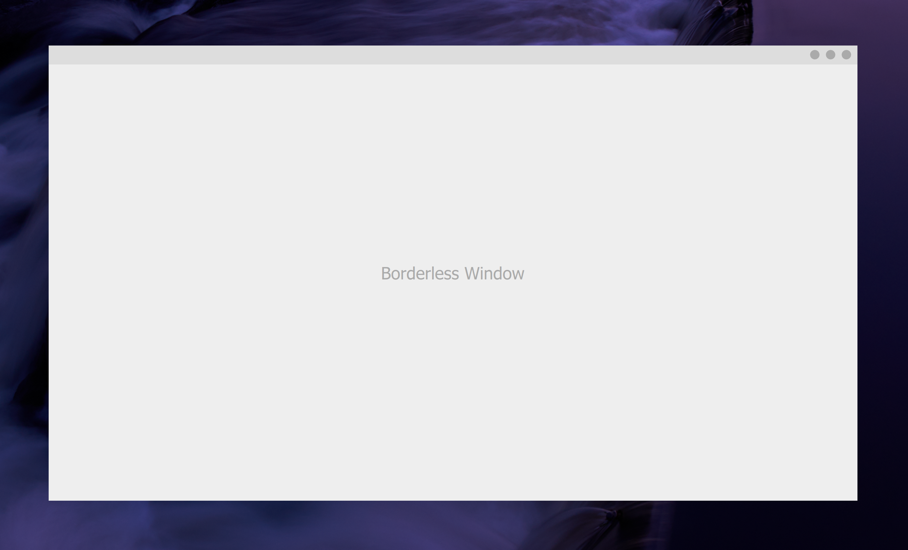

# Qt Quick Borderless Window
A borderless window for Windows Qt Quick/QML applications.

## Options
   * Window size

   * Window position (automatically centers by default)

   * Minimum window size

   * Background color (can become temporarily visible when resizing)

   * Resize area thickness

   * Grab area height, left margin, and right margin

   * Enable or disable left and top resizing

   * Enable or disable displaying QML while resizing

## Notes
   * Set the native window's properties only after creating the QML window, otherwise
   * DPI scaling will not be applied.

   * Enabling top and left resizing results in undesirable window movement while
      resizing. This is minor when displaying the QML window while resizing is
      disabled, but results in flickering movement when it is enabled.

   * Enabling displaying QML window while resizing results in lag when resizing. This is
      due to the OpenGL context having to be recreated for each different size. Note
      that the default QML fades in the contents every time the window size changes,
      so you will need to edit the QML file and remove the fade in code to really see
      the effects of enabling this option.